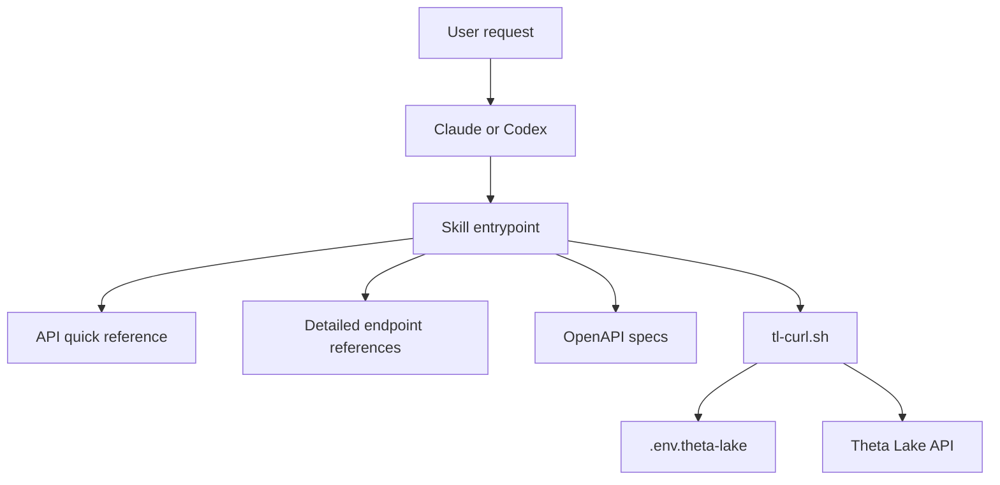

# Theta Lake API Skill Internal

Theta Lake API Skill Internal packages Theta Lake API reference material and helper workflows for AI coding assistants. It supports both Claude slash commands and Codex skills so the same endpoint catalog, safety rules, and authenticated request wrapper can be used from either tool.

The project exists to make Theta Lake API work repeatable: an assistant can map a natural-language request to the right endpoint, inspect detailed parameter references, compose a curl command, and summarize responses without manually searching the OpenAPI spec each time.

## Features

- Claude command at `.claude/commands/theta-lake.md`.
- Codex skill at `theta-lake-api/SKILL.md`.
- Quick endpoint catalog in `theta-lake-api/api-quick-ref.md`.
- Detailed API references for search, cases, records, workflows, identities, ingestion, legal hold, users, groups, workspaces, and other endpoints.
- OpenAPI specs in the repo root and mirrored into `theta-lake-api/` for Codex installation.
- Authenticated curl wrapper in `scripts/tl-curl.sh`.
- Credential template in `.env.theta-lake.example`.

## Architecture



Claude uses `.claude/commands/theta-lake.md` as a slash command entrypoint. Codex uses `theta-lake-api/SKILL.md` as its skill entrypoint. Both point at the same API reference content and use the same request wrapper.

## Prerequisites

- Git.
- Bash.
- `curl`.
- `jq` for token parsing and JSON formatting.
- Access to a Theta Lake tenant and API credentials.
- Claude Code for the Claude command workflow, or Codex for the Codex skill workflow.

## Setup

Clone the repository:

```bash
git clone https://github.com/adiregev-tl/ThetaLake_API_Skill_Internal.git
cd ThetaLake_API_Skill_Internal
```

Create a local credentials file:

```bash
cp .env.theta-lake.example .env.theta-lake
```

Edit `.env.theta-lake` with your tenant URL and credentials. Do not commit `.env.theta-lake`.

## Configuration

`scripts/tl-curl.sh` reads `.env.theta-lake` from the repository root when used from the checked-out repo.

Required:

- `TL_BASE_URL`: Theta Lake API base URL.

Authentication option 1:

- `TL_API_TOKEN`: static bearer token.

Authentication option 2:

- `TL_CLIENT_ID`: OAuth client id.
- `TL_CLIENT_SECRET`: OAuth client secret.
- `TL_TOKEN_URL`: OAuth token endpoint.

## Claude Usage

The Claude entrypoint is `.claude/commands/theta-lake.md`.

From Claude Code, use the command with a natural-language request:

```text
/theta-lake list open cases
/theta-lake search for high risk records from the last 7 days
/theta-lake who am I?
```

The command reads the quick reference, selects detailed reference files when needed, composes a `tl-curl.sh` command, and asks for confirmation before write operations.

## Codex Installation

Install the Codex skill from this repository:

```bash
python3 ~/.codex/skills/.system/skill-installer/scripts/install-skill-from-github.py \
  --repo adiregev-tl/ThetaLake_API_Skill_Internal \
  --path theta-lake-api
```

Restart Codex after installing new skills.

The Codex skill entrypoint is `theta-lake-api/SKILL.md`. It is colocated with the API reference files, OpenAPI specs, and a copy of the request wrapper so the skill installer can copy a complete skill directory.

## API Request Wrapper

Use `scripts/tl-curl.sh` for authenticated requests from a clone:

```bash
./scripts/tl-curl.sh GET /token/context
./scripts/tl-curl.sh GET "/cases?status=open&max=50"
./scripts/tl-curl.sh POST /search/records -d '{"range":{"days":7},"risk":["high"]}'
```

Read operations can be executed directly. Write operations such as `POST`, `PUT`, `PATCH`, and `DELETE` should be reviewed before execution.

## API Reference

Start with `theta-lake-api/api-quick-ref.md` to identify endpoint candidates.

Use detailed references for request parameters and response interpretation:

- `theta-lake-api/auth-guide.md`
- `theta-lake-api/cases-api.md`
- `theta-lake-api/common-patterns.md`
- `theta-lake-api/identities-api.md`
- `theta-lake-api/ingestion-api.md`
- `theta-lake-api/legal-hold-api.md`
- `theta-lake-api/other-endpoints-api.md`
- `theta-lake-api/records-api.md`
- `theta-lake-api/search-api.md`
- `theta-lake-api/supervision-spaces-api.md`
- `theta-lake-api/users-groups-api.md`
- `theta-lake-api/workflows-api.md`
- `theta-lake-api/workspaces-api.md`

Use `theta_lake_api_v1.yml` or `theta_lake_api_v1_23.yml` for exact schemas.

## Project Layout

```text
.
|-- .claude/commands/theta-lake.md    # Claude slash command
|-- .env.theta-lake.example           # Local credential template
|-- README.md                         # Project and setup guide
|-- scripts/tl-curl.sh                # Authenticated API wrapper for repo clones
|-- theta-lake-api/
|   |-- SKILL.md                      # Codex skill entrypoint
|   |-- api-quick-ref.md              # Endpoint catalog
|   |-- scripts/tl-curl.sh            # Authenticated API wrapper for installed Codex skill
|   |-- theta_lake_api_v1.yml         # OpenAPI spec for installed Codex skill
|   |-- theta_lake_api_v1_23.yml      # OpenAPI spec variant for installed Codex skill
|   `-- *-api.md                      # Detailed endpoint references
|-- theta_lake_api_v1.yml             # OpenAPI spec
`-- theta_lake_api_v1_23.yml          # OpenAPI spec variant
```

## Design Choices

- The Claude and Codex entrypoints are separate because each assistant expects a different skill format.
- API reference files live in Markdown so assistants can read focused sections without loading the full OpenAPI spec.
- The quick reference is optimized for endpoint selection; detailed references are used only after the endpoint family is known.
- The curl wrapper centralizes authentication and response formatting.
- Local secrets are kept in `.env.theta-lake`, which is ignored by git.
